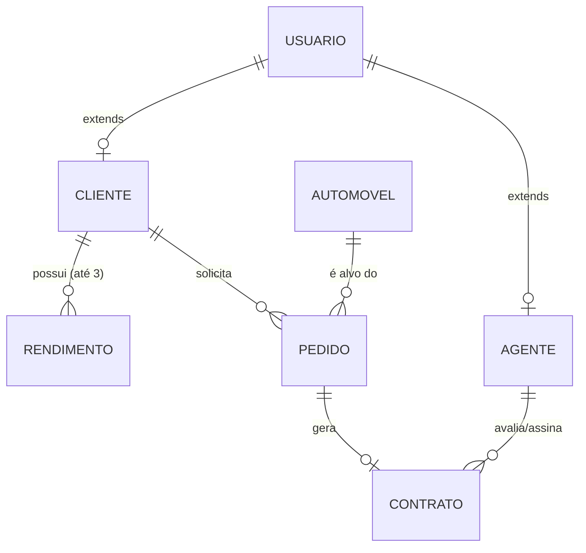

# 🚗 Plataforma Enterprise: Gestão de Aluguel de Veículos

<p align="center">
  
  
  
  
</p>

Este projeto é um sistema web corporativo **Fullstack** desenhado para gerenciar o ciclo de vida completo da locação de automóveis. A plataforma resolve as deficiências de processos manuais ofertando portais isolados para **Clientes** (solicitação de crédito e aluguel) e **Agentes/Bancos** (avaliação de crédito e aprovação de frotas).

---

## 🎯 Principais Funcionalidades

- **Autenticação e Autorização**: Sistema unificado com perfis de acesso restritos (Cliente vs Administração/Agente).
- **Gestão de Perfil Pessoal**: Clientes incluem rendimentos financeiros e documentação para aprovação de risco.
- **Painel de Aprovação (Agentes)**: Fluxo de aprovação ou recusa baseada na análise financeira.
- **Vitrine Automotiva**: Interface moderna para filtragem e visualização de frotas disponíveis em tempo real.
- **Contratos e Auditoria**: Geração automática de contratos associados legalmente ao requisitante e aprovação da entidade fiadora (banco ou seguradora).

---
## 👥 Autores

<<<<<<< HEAD
## 📐 Arquitetura do Sistema

Abaixo, a representação da arquitetura distribuída entre o Frontend de componente único (React) e a API Monolítica Modular (Micronaut).

```mermaid
graph TD
    Client[Navegador UI - React/Vite]
    API[Micronaut Backend API]
    DB[(PostgreSQL Database)]

    Client <-->|Requisições HTTP/REST| API
    API <-->|Micronaut Data / Hibernate| DB

    subgraph Backend Layers
        Controller[Controllers & Security]
        Service[Business Logic Services]
        Repo[JPA Repositories]
        Controller --> Service
        Service --> Repo
    end
    API --- Backend Layers
```

---

## 🛠️ Tecnologias e Dependências Profundas

- **Backend Layers**:
  - `Java 21` (Records, Switch Expressions, Virtual Threads ready).
  - `Micronaut HTTP Server Netty` (Alta performance assíncrona).
  - `Micronaut Data Hibernate JPA` (OR-Mapping com o padrão Data Repositories).
  - `Micronaut Serde Jackson` (Serialização e desserialização ultra rápida nativa otimizada).

- **Frontend Toolkit**:
  - `React 19` + `Vite` (Build tool super veloz, HMR instantâneo).
  - `React Router DOM` v7 (Navegação contextual global).
  - `Tailwind CSS` (Atomic UI robusta e responsiva).

---

## 📊 Estrutura do Banco de Dados (Diagrama E-R Básico)

O fluxo core do negócio se divide nestas entidades vitais no banco relacional `PostgreSQL`:



---

## 🔄 API REST: Endpoints Principais (Backend)

Aqui está o mapa geral dos recursos disponibilizados para que o React interaja via `Axios`/`Fetch`:

| Rota / Endpoint | Método | Descrição | Requer Auth | Papel Mínimo |
|-------------------------|--------|----------------------------------------------------|-------------|----------------|
| `/api/auth/register`    | `POST` | Cadastro inicial (Usuário e Senha)                 | Não         | -              |
| `/api/auth/login`       | `POST` | Retorna Token ou Autorização de Sessão             | Não         | -              |
| `/api/clientes/{id}`    | `GET`  | Busca os dados biográficos e rendimentos do cliente| Sim         | Cliente/Admin  |
| `/api/automoveis`       | `GET`  | Lista a frota e catálogo disponíveis               | Sim         | Autenticado    |
| `/api/automoveis`       | `POST` | Cadastro de nova placa e dados de documento veicular| Sim        | Agente/Banco   |
| `/api/pedidos`          | `POST` | Cliente inicia o desejo de alugar automóvel X      | Sim         | Cliente        |
| `/api/pedidos/{id}`     | `PUT`  | Modificar dados atrelados antes da aprovação       | Sim         | Todos          |
| `/api/pedidos/agente`   | `GET`  | Retorna a fila para painel de aprovação das agências| Sim        | Agente         |

*(Nota: Alguns endpoints dependem do `SimpleCorsFilter` habilitar os métodos PUT, POST, DELETE na camada de controle do Micronaut).*

---

## 📂 Arquitetura Completa de Pastas 
=======
Liste os principais contribuidores. Você pode usar links para seus perfis.

| 👤 Nome | 🖼️ Foto | :octocat: GitHub | 💼 LinkedIn | 📤 Gmail |
|---------|----------|-----------------|-------------|-----------|
| Davi Nunes Carvalho | <div align="center"></div> | <div align="center"><a href="https://github.com/Davii13"></a></div> | <div align="center"><a href="#"></a></div> | <div align="center"><a href="mailto:seuemail@gmail.com"></a></div> |
| João Victor Russo Marquito | <div align="center"></div> | <div align="center"><a href="https://github.com/joaovictorz10"></a></div> | <div align="center"><a href="#"></a></div> | <div align="center"><a href="mailto:seuemail@gmail.com"></a></div> |

---
## 📂 Estrutura do Projeto
>>>>>>> 46626b913f04eab47fce830bf8d982a94677ca8d

### 🔙 Backend (Micronaut)
```text
Sistemas-de-aluguel-de-carros/codigo/GestaoAluguelVeiculos/src
├── main/
│   ├── java/br/gestao/
│   │   ├── config/              # Inicialização + Segurança (Ex: SimpleCorsFilter.java)
│   │   ├── controller/          # Endpoints acima mapeados (*Controller.java)
│   │   ├── dto/                 # Objects for REST Payload (Requisição e Resposta JSON)
│   │   ├── enums/               # Domínios de Status (Role, TipoAgente, TipoProprietario)
│   │   ├── model/               # Modelos mapeados pelo JPA (*.java referenciando DB)
│   │   ├── repository/          # Interfaces CRUD estendendo Data JPA
│   │   ├── service/             # Injeções de regras de negócios pesadas
│   │   └── Application.java     # Script Ponto de Entrada da JVM
│   │
│   └── resources/
│       ├── application.properties  # Credentials, Drivers, HikariCP Settings
│       └── logback.xml             # Logs de console de aplicação
│
└── test/java/br/gestao/            # Suíte de Testes (JUnit 5 + Micronaut Test)
```

### 🎨 Frontend (React/Vite)
```text
Sistemas-de-aluguel-de-carros/codigo/frontend/src
├── assets/                      # Imagens estáticas, SVGs, Logotipos
├── components/                  # (Opcional - caso expandido) Inputs, Dialogs e Buttons base
├── layouts/                     # Embrulhos Visuais Master (Ex: DashboardLayout.jsx contendo Menus)
├── pages/                       # Telas baseadas em rotas
│   ├── Admin/                   # Telas exclusivas p/ Agentes (Clients.jsx, Fleet.jsx, Requests.jsx)
│   ├── Auth/                    # Telas de Entrada Livre (Login.jsx, Register.jsx)
│   ├── Client/                  # Fluxo de quem tem intenção de Renda (Catalog.jsx, Orders.jsx, Profile.jsx)
│   └── Home/                    # Gateways após autenticação (AgentDashboard, ClientDashboard)
├── App.jsx                      # O Mapeador Oficial de Rotas (<Routes>)
└── main.jsx                     # Injector React no `index.html` público
```

---

## 🏃 Passo a Passo para Execução e Build Local

### 1. Clonando e Configurando Variáveis (PostgreSQL)
Tenha banco PostgreSQL ativo e responda localmente. Atualize seu repositório:
```bash
git clone <url-do-seu-repo>; cd Sistemas-de-aluguel-de-carros
```
Ajuste `codigo/GestaoAluguelVeiculos/src/main/resources/application.properties`:
```properties
datasources.default.url=jdbc:postgresql://localhost:5432/A_SUA_DATABASE
datasources.default.username=SEU_USUARIO_POSTGRES
datasources.default.password=SUA_SENHA_POSTGRES
# Por padrão, o Hibernate tentará inicializar/atualizar o schema tabelar
```

### 2. Rodando o Java + Micronaut Backend
Utilizando as ferramentas integradas:
```bash
cd codigo/GestaoAluguelVeiculos
# Limpa sujeiras antigas e compila
./mvnw clean compile
# Levanta o serviço na porta :8080 local
./mvnw mn:run
```
<<<<<<< HEAD

#### Para Rodar Bateria de Testes (TDD/Automated):
```bash
./mvnw test
```
=======
### 2️⃣ Frontend

Certifique-se de ter o **Node.js** instalado.

```bash
# Navegue até a pasta do frontend
cd frontend-folder

# Instale as dependências
npm install

# Inicie o servidor de desenvolvimento
npm run dev
```
# Histórias de Usuário - Sistema de Aluguel de Carros
>>>>>>> 46626b913f04eab47fce830bf8d982a94677ca8d

### 3. Subindo o Frontend (Vite)
Aproveite o terminal dinâmico do Node. Em outra aba:
```bash
cd codigo/frontend
# Verifique integridades de bibliotecas
npm install
# Subida de Ambiente em modo HMR e DEV (Porta :5173 tipicamente)
npm run dev
```

### 4. Construindo para Produção
Caso deseje distribuir no ar (na Vercel, AWS, etc):
- **Frontend**: Rode `npm run build` na pasta `frontend`. Os estáticos cairão na pasta `/dist`.
- **Backend**: Rode `./mvnw package`. O `.jar` final unificado estará dentro do respectivo `target/`.

---

## 📖 Fluxo de Histórias de Usuário Atendidas (Roadmap)

✅ **US01:** Cadastro prévio unificado para triagem inicial.  
✅ **US02 / US03 / US04 / US05:** Clientes introduzem desejos no "Catálogo", consultam aba "Orders/Pedidos" e realizam modificações ou cancelamentos antes que um avalista os olhe.  
✅ **US06 / US07:** Agentes monitoram um grande Painel Financeiro para modificar dados burocráticos ou analisar viabilidade baseado em Score do cliente.  
✅ **US08 / US09:** Ao deferir positivamente os aluguéis, geram-se links de Contrato firmados com bancos para dar lastro à frota.  
✅ **US10 a US12:** Manutenção de bases de dados fortes de rendimentos do contratante e amarração absoluta entre a Placa/Modelo do carro e a agência ou dono verdadeiro.


