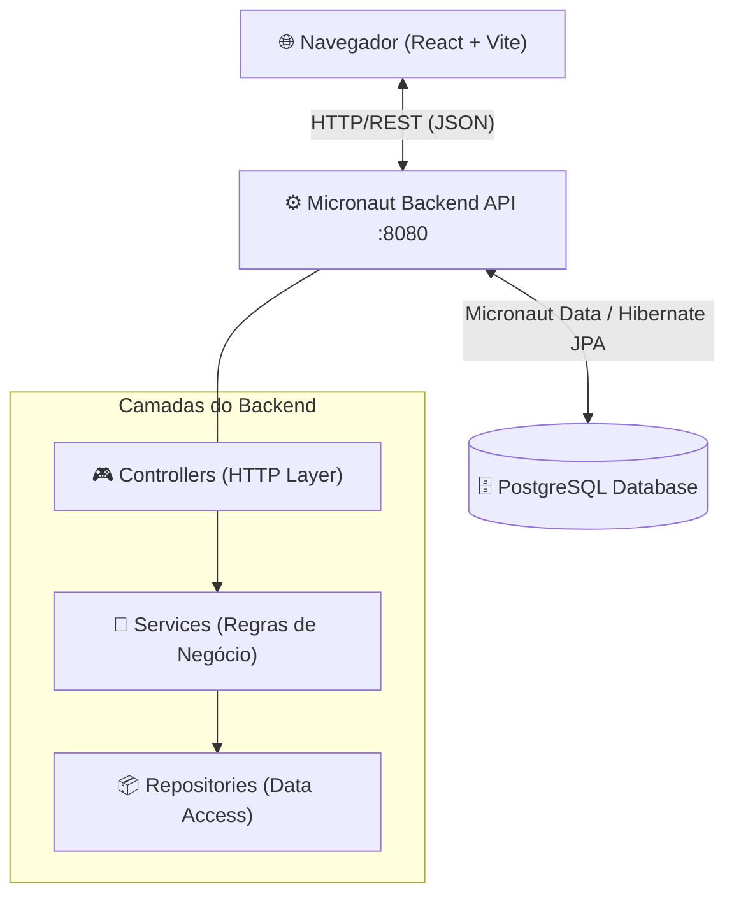
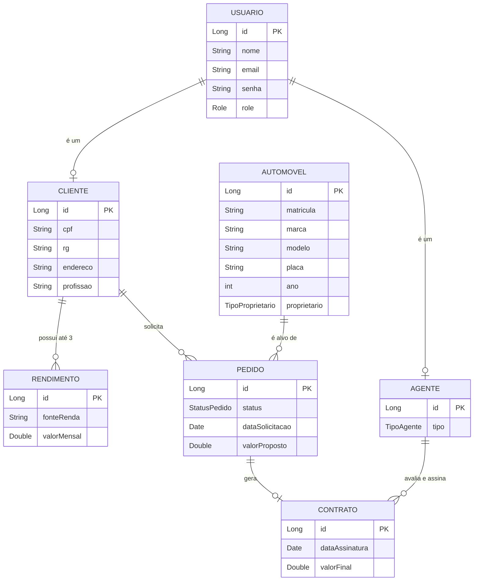

# 🚗 Plataforma Enterprise: Gestão de Aluguel de Veículos

<p align="center">
  
  
  
  
  
  
</p>

<p align="center">
  Sistema web corporativo <strong>Fullstack</strong> para gerenciar o ciclo de vida completo da locação de automóveis, com portais isolados para <strong>Clientes</strong> e <strong>Agentes/Bancos</strong>.
</p>

---
## 👥 Autores

| 👤 Nome | 🖼️ Foto | :octocat: GitHub | 💼 LinkedIn | 📧 E-mail |
|---------|----------|-----------------|-------------|-----------|
| Davi Nunes Carvalho | <div align="center"></div> | <div align="center"><a href="https://github.com/Davii13"></a></div> | <div align="center"><a href="#"></a></div> | <div align="center"><a href="mailto:seuemail@gmail.com">davinunescarvalho35@gmail.com</a></div> |
| João Victor Russo Marquito | <div align="center"></div> | <div align="center"><a href="https://github.com/joaovictorz10"></a></div> | <div align="center"><a href="#"></a></div> | <div align="center"><a href="mailto:seuemail@gmail.com">seuemail@gmail.com</a></div> |

---
## 📋 Índice

- [Sobre o Projeto](#-sobre-o-projeto)
- [Principais Funcionalidades](#-principais-funcionalidades)
- [Arquitetura do Sistema](#-arquitetura-do-sistema)
- [Tecnologias Utilizadas](#-tecnologias-utilizadas)
- [Banco de Dados — Diagrama E-R](#-estrutura-do-banco-de-dados-diagrama-e-r)
- [API REST — Endpoints](#-api-rest-endpoints-principais)
- [Estrutura de Pastas](#-arquitetura-completa-de-pastas-e-arquivos)
- [Como Rodar](#-passo-a-passo-para-execução-local)
- [Histórias de Usuário](#-histórias-de-usuário)
- [Autores](#-autores)

---

## 💡 Sobre o Projeto

Este projeto resolve as deficiências de processos manuais de locação vehicular, oferecendo:

- **Portal do Cliente**: solicitação de crédito, visualização de catálogo, gerenciamento de pedidos e perfil financeiro.
- **Portal do Agente/Banco**: avaliação financeira, aprovação de contratos, gestão de frota e auditoria completa.

O backend expõe uma **API REST** construída com Micronaut, consumida pelo frontend React. O banco de dados relacional **PostgreSQL** é gerenciado via Hibernate JPA.

---

## 🎯 Principais Funcionalidades

| Funcionalidade | Descrição |
|---|---|
| 🔐 **Autenticação** | Sistema unificado com perfis distintos (Cliente / Agente / Admin) |
| 👤 **Gestão de Perfil** | Clientes cadastram rendimentos, endereços e documentos para análise de risco |
| 🚙 **Vitrine Automotiva** | Interface de catálogo para visualizar e filtrar frota disponível |
| 📋 **Pedidos de Aluguel** | Criação, consulta, modificação e cancelamento de pedidos |
| ✅ **Painel de Aprovação** | Agentes analisam, modificam e aprovam ou recusam pedidos financeiros |
| 📑 **Geração de Contratos** | Contratos legais gerados automaticamente com vinculação de fiador (banco/seguradora) |
| 🏛️ **Gestão de Frota** | Cadastro, edição e remoção de veículos da frota com proprietário associado |

---
## 🎥 Demonstração

Use GIFs e prints para mostrar o projeto em ação.  

> [!WARNING]
> Dê preferência a hospedar suas imagens em um **CDN** (Content Delivery Network) ou no **GitHub Pages** para garantir que elas carreguem rapidamente e não quebrem. Saiba mais sobre o GitHub Pages clicando [aqui](https://github.com/joaopauloaramuni/joaopauloaramuni.github.io).

### 📱 Aplicativo Mobile

- GIF de demonstração (exemplo de fluxo de usuário):  

| Demonstração 1 | Demonstração 2 | Demonstração 3 | Demonstração 4 |
|----------------|----------------|----------------|----------------|
|  |  |  |  |
| _Sua gif aqui_ | _Sua gif aqui_ | _Sua gif aqui_ | _Sua gif aqui_ |

Para melhor visualização, as telas principais estão organizadas lado a lado.

| Tela | Captura de Tela |
| :---: | :---: |
| **Tela Inicial (Home)** | **Tela de Perfil / Settings** |
| 
" height="120px"> |  |
| **Tela de Cadastro** | **Tela de Lista / Detalhes** |
|  |  |

### 🌐 Aplicação Web

Para melhor visualização, as telas principais estão organizadas lado a lado.

| Tela | Captura de Tela |
| :---: | :---: |
| **Página Inicial (Home)** | **Página de Login** |
|  |  |
| **Cadastro de Clientes** | **Cadastro de Produtos** |
|  |  |
| **Dashboard (Visão Geral)** | **Página Admin / Configurações** |
|  |  |

## 📐 Arquitetura do Sistema

A arquitetura separa claramente o Frontend (SPA React) da API Monolítica Modular (Micronaut), comunicando-se via HTTP/REST.



---

## 🛠️ Tecnologias Utilizadas

### Backend (`codigo/GestaoAluguelVeiculos`)

| Tecnologia | Versão | Função |
|---|---|---|
| **Java** | 21 | Linguagem principal (Records, Switch Expressions) |
| **Micronaut Framework** | 4.10.11 | Framework web de alta performance para JVM |
| **Micronaut HTTP Server Netty** | - | Servidor HTTP assíncrono e não-bloqueante |
| **Micronaut Data Hibernate JPA** | - | ORM para mapeamento objeto-relacional |
| **Micronaut Serde Jackson** | - | Serialização/Desserialização JSON otimizada |
| **PostgreSQL** | - | Banco de dados relacional de produção |
| **HikariCP** | - | Pool de conexões de alto desempenho |
| **Maven** | - | Gerenciador de dependências e build |

### Frontend (`codigo/frontend`)

| Tecnologia | Versão | Função |
|---|---|---|
| **React** | 19 | Biblioteca para criação de interfaces (SPA) |
| **Vite** | latest | Bundler e server de desenvolvimento ultrarrápido |
| **React Router DOM** | v7 | Roteamento dinâmico sem recarregar a página |
| **Tailwind CSS** | - | Framework CSS utilitário e responsivo |
| **Lucide React** | - | Biblioteca de ícones modernos e leves |

---

## 📊 Estrutura do Banco de Dados (Diagrama E-R)

O modelo de negócio é representado pelas seguintes entidades no PostgreSQL:



---

## 🔄 API REST: Endpoints Principais

Mapa completo dos recursos disponibilizados pela API Micronaut:

| Rota | Método | Descrição | Auth | Papel |
|------|--------|-----------|------|-------|
| `/api/auth/register` | `POST` | Cadastro de novo usuário (Cliente ou Agente) | ❌ | — |
| `/api/auth/login` | `POST` | Login e retorno de sessão/token | ❌ | — |
| `/api/clientes` | `GET` | Lista todos os clientes cadastrados | ✅ | Admin |
| `/api/clientes/{id}` | `GET` | Busca dados biográficos e rendimentos do cliente | ✅ | Cliente/Admin |
| `/api/clientes/{id}` | `PUT` | Atualiza dados pessoais e rendimentos do cliente | ✅ | Cliente/Admin |
| `/api/automoveis` | `GET` | Lista frota e catálogo disponíveis | ✅ | Autenticado |
| `/api/automoveis` | `POST` | Cadastra novo veículo na frota | ✅ | Agente/Admin |
| `/api/automoveis/{id}` | `PUT` | Atualiza dados de um veículo | ✅ | Agente/Admin |
| `/api/automoveis/{id}` | `DELETE` | Remove veículo da frota | ✅ | Agente/Admin |
| `/api/pedidos` | `GET` | Lista todos os pedidos do cliente logado | ✅ | Cliente |
| `/api/pedidos` | `POST` | Cliente cria novo pedido de aluguel | ✅ | Cliente |
| `/api/pedidos/{id}` | `PUT` | Modifica dados do pedido antes da aprovação | ✅ | Todos |
| `/api/pedidos/{id}` | `DELETE` | Cancela/remove um pedido | ✅ | Todos |
| `/api/pedidos/agente` | `GET` | Fila de pedidos para análise dos agentes | ✅ | Agente |

> ⚠️ O filtro `SimpleCorsFilter` libera os métodos `PUT`, `POST`, `DELETE` para o frontend em `localhost:5173`.

---

## 📂 Arquitetura Completa de Pastas e Arquivos

### 🔙 Backend — `codigo/GestaoAluguelVeiculos/`

```text
GestaoAluguelVeiculos/
├── src/
│   ├── main/
│   │   ├── java/br/gestao/
│   │   │   │
│   │   │   ├── config/                     # Configurações Globais da Aplicação
│   │   │   │   ├── SimpleCorsFilter.java   # Libera CORS p/ o frontend React
│   │   │   │   └── StartupListener.java    # Seed inicial (cria Admin padrão no DB)
│   │   │   │
│   │   │   ├── controller/                 # Controladores HTTP — Endpoints REST
│   │   │   │   ├── AuthController.java     # POST /api/auth/register e /login
│   │   │   │   ├── AutomovelController.java# CRUD /api/automoveis
│   │   │   │   ├── ClienteController.java  # CRUD /api/clientes (perfil e rendimentos)
│   │   │   │   ├── FrontendController.java # Fallback de rotas SPA em produção
│   │   │   │   └── PedidoController.java   # CRUD /api/pedidos (fluxo de aprovação)
│   │   │   │
│   │   │   ├── dto/                        # Data Transfer Objects (Payload JSON)
│   │   │   │   ├── AuthResponse.java       # Resposta de autenticação (token/id/role)
│   │   │   │   ├── AutomovelDTO.java       # Payload de criação/edição de veículo
│   │   │   │   ├── ClienteDTO.java         # Dados pessoais e rendimentos do cliente
│   │   │   │   ├── ContratoDTO.java        # Dados de contrato gerado
│   │   │   │   ├── CreatePedidoRequest.java# Requisição de novo pedido de aluguel
│   │   │   │   ├── LoginRequest.java       # Email + Senha para login
│   │   │   │   ├── PedidoDTO.java          # Representação de pedido para o frontend
│   │   │   │   ├── RegisterRequest.java    # Dados de cadastro de novo usuário
│   │   │   │   └── RendimentoDTO.java      # Fonte e valor de cada rendimento
│   │   │   │
│   │   │   ├── enums/                      # Domínios de valores fixos (Status/Tipos)
│   │   │   │   ├── Role.java               # CLIENTE | AGENTE | ADMIN
│   │   │   │   ├── StatusPedido.java       # PENDENTE | APROVADO | RECUSADO | CANCELADO
│   │   │   │   ├── TipoAgente.java         # EMPRESA | BANCO | SEGURADORA
│   │   │   │   └── TipoProprietario.java   # AGENCIA | BANCO | CLIENTE
│   │   │   │
│   │   │   ├── exception/                  # Gerenciamento Global de Exceções
│   │   │   │   └── GlobalExceptionHandler.java # Tratamento unificado de erros da API
│   │   │   │
│   │   │   ├── model/                      # Entidades JPA — Tabelas do PostgreSQL
│   │   │   │   ├── Agente.java             # Entidade de Agente/Banco avaliador
│   │   │   │   ├── Automovel.java          # Veículo da frota (marca, modelo, placa)
│   │   │   │   ├── Cliente.java            # Perfil completo do cliente contratante
│   │   │   │   ├── Contrato.java           # Contrato gerado após aprovação do pedido
│   │   │   │   ├── Pedido.java             # Pedido de aluguel associando Cliente+Carro
│   │   │   │   ├── Rendimento.java         # Fonte de renda vinculada ao Cliente
│   │   │   │   └── Usuario.java            # Usuário base com email, senha e role
│   │   │   │
│   │   │   ├── repository/                 # Interfaces DAO — Micronaut Data JPA
│   │   │   │   ├── AgenteRepository.java
│   │   │   │   ├── AutomovelRepository.java
│   │   │   │   ├── ClienteRepository.java
│   │   │   │   ├── ContratoRepository.java
│   │   │   │   ├── PedidoRepository.java
│   │   │   │   ├── RendimentoRepository.java
│   │   │   │   └── UsuarioRepository.java
│   │   │   │
│   │   │   ├── service/                    # Lógica de Negócio e Regras de Validação
│   │   │   │   ├── AutomovelService.java   # Regras de frota, validação de cadastro
│   │   │   │   ├── ClienteService.java     # Atualização de perfil e rendimentos
│   │   │   │   └── PedidoService.java      # Fluxo de aprovação, geração de contrato
│   │   │   │
│   │   │   └── Application.java            # Main — Ponto de entrada da JVM
│   │   │
│   │   └── resources/
│   │       ├── application.properties      # Configurações: DB, porta, Hibernate DDL
│   │       └── logback.xml                 # Configuração de logs do console
│   │
│   └── test/java/br/gestao/
│       └── GestaoAluguelVeiculosTest.java  # Testes de integração (JUnit 5)
│
└── pom.xml                                 # Dependências e plugins Maven
```

### 🎨 Frontend — `codigo/frontend/`

```text
frontend/
├── src/
│   ├── assets/                         # Recursos estáticos (Imagens, SVG)
│   │   ├── bg-car.png                  # Background premium do login
│   │   ├── hero.png                    # Hero image da Landing Page
│   │   ├── react.svg
│   │   └── vite.svg
│   │
│   ├── components/                     # Componentes React Reutilizáveis
│   │   └── NotificationModal.jsx       # Modal para alertas e notificações
│   │
│   ├── context/                        # Gerenciamento de Estado Global
│   │   └── NotificationContext.jsx     # Contexto para notificações sistêmicas
│   │
│   ├── layouts/                        # Estruturas visuais base (Master Pages)
│   │   └── DashboardLayout.jsx         # Sidebar + Navbar global do painel logado
│   │
│   ├── pages/                          # Telas da aplicação por papel de usuário
│   │   │
│   │   ├── Admin/                      # Telas exclusivas de Agentes e Admins
│   │   │   ├── Clients.jsx             # Tabela completa de clientes cadastrados
│   │   │   ├── Fleet.jsx               # Cadastro e gestão de veículos da frota
│   │   │   └── Requests.jsx            # Fila de pedidos para análise/aprovação
│   │   │
│   │   ├── Auth/                       # Telas públicas de autenticação
│   │   │   ├── Login.jsx               # Formulário de acesso renovado
│   │   │   └── Register.jsx            # Cadastro de Conta (Cliente ou Agente)
│   │   │
│   │   ├── Client/                     # Telas exclusivas de Clientes
│   │   │   ├── Catalog.jsx             # Vitrine de carros para iniciar pedido
│   │   │   ├── Orders.jsx              # Acompanhamento dos pedidos realizados
│   │   │   └── Profile.jsx             # Atualização de RG, Endereço e Rendimentos
│   │   │
│   │   └── Home/                       # Dashboards e Landing Page
│   │       ├── AgentDashboard.jsx      # Painel inicial do Agente com métricas
│   │       ├── ClientDashboard.jsx     # Painel inicial do Cliente com atalhos
│   │       ├── Dashboard.jsx           # Router inteligente por Role do usuário
│   │       └── LandingPage.jsx         # Nova página inicial institucional (Premium)
│   │
│   ├── App.css                         # Estilos globais do App
│   ├── App.jsx                         # Configuração de todas as rotas (<Routes>)
│   ├── index.css                       # Design System, Cores e Tailwind Base
│   └── main.jsx                        # Ponto de entrada React
│
├── index.html                          # HTML raiz da SPA
├── vite.config.js                      # Configuração do Bundler Vite
└── package.json                        # Versões de logs e scripts Node
```

---

## 🏃 Passo a Passo para Execução Local

### ✅ Pré-requisitos

Antes de começar, garanta que possui instalado:

- **[Java JDK 21](https://adoptium.net/)** — necessário para compilar e rodar o backend
- **[Apache Maven](https://maven.apache.org/)** — ou use o Maven Wrapper `./mvnw` embutido
- **[Node.js 18+](https://nodejs.org/)** e **npm** — para rodar o frontend
- **[PostgreSQL 14+](https://www.postgresql.org/)** — banco de dados rodando localmente

---

### 1️⃣ Configurando o Banco de Dados (PostgreSQL)

1. Inicie o serviço PostgreSQL (porta padrão `5432`).
2. Crie o banco de dados:
   ```sql
   CREATE DATABASE gestao_aluguel;
   ```
3. Edite o arquivo de configuração do backend:
   ```
   codigo/GestaoAluguelVeiculos/src/main/resources/application.properties
   ```
   ```properties
   datasources.default.url=jdbc:postgresql://localhost:5432/gestao_aluguel
   datasources.default.username=postgres
   datasources.default.password=sua_senha_aqui
   datasources.default.driver-class-name=org.postgresql.Driver
   ```

> 💡 O Hibernate criará/atualizará as tabelas automaticamente na primeira execução.

---

### 2️⃣ Rodando o Backend (API Micronaut)

Abra um terminal na raiz do projeto:

```bash
# Entre na pasta do backend
cd codigo/GestaoAluguelVeiculos

# Compile o projeto (baixa dependências na primeira vez)
./mvnw clean compile

# Inicie o servidor de desenvolvimento
./mvnw mn:run
```

✅ Sucesso: o terminal exibirá `Server Running: http://localhost:8080`

#### Rodar os Testes Automatizados:
```bash
./mvnw test
```

#### Gerar o JAR para Produção:
```bash
./mvnw package
# O arquivo executável estará em: target/GestaoAluguelVeiculos-0.1.jar
java -jar target/GestaoAluguelVeiculos-0.1.jar
```

---

### 3️⃣ Rodando o Frontend (React + Vite)

Abra **outro** terminal:

```bash
# Entre na pasta do frontend
cd codigo/frontend

# Instale as dependências (execute apenas na primeira vez ou após atualizar package.json)
npm install

# Inicie o servidor de desenvolvimento com hot-reload
npm run dev
```

✅ Sucesso: acesse **[http://localhost:5173](http://localhost:5173)** no seu navegador.

#### Build para Produção:
```bash
npm run build
# Os arquivos estáticos estarão em: frontend/dist/
```

---

## 📖 Histórias de Usuário

| ID | Épico | Descrição | Status |
|----|-------|-----------|--------|
| US01 | Acesso e Cadastro | Cadastro prévio para acesso ao sistema com papel definido | ✅ |
| US02 | Portal do Cliente | Introduzir pedido de aluguel via catálogo online | ✅ |
| US03 | Portal do Cliente | Consultar os próprios pedidos e seus status | ✅ |
| US04 | Portal do Cliente | Modificar pedido antes da aprovação do agente | ✅ |
| US05 | Portal do Cliente | Cancelar pedido de aluguel em aberto | ✅ |
| US06 | Portal do Agente | Análise financeira de pedidos na fila de aprovação | ✅ |
| US07 | Portal do Agente | Modificar valores e termos do pedido durante avaliação | ✅ |
| US08 | Portal do Agente | Aprovar pedido e encaminhar à geração de contrato | ✅ |
| US09 | Portal do Agente | Associar contrato de crédito bancário ao aluguel | ✅ |
| US10 | Dados Cadastrais | Armazenar dados do contratante (CPF, RG, endereço, rendimentos) | ✅ |
| US11 | Dados Cadastrais | Registrar dados do automóvel (matrícula, marca, modelo, placa) | ✅ |
| US12 | Dados Cadastrais | Registrar propriedade do veículo (agência, banco ou terceiro) | ✅ |

---


<p align="center">
  Feito com ☕ Java e ⚛️ React
</p>
